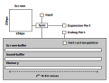
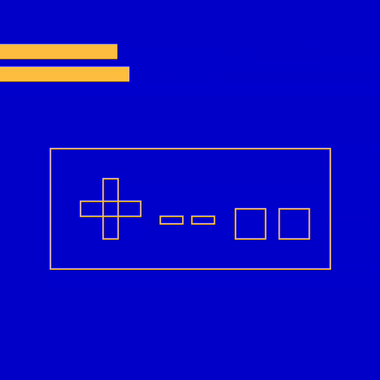

# SVC16: A Simple Virtual Computer

<div align="center">

  </div>
This is the specification for an extremely simple "virtual computer" that can be emulated.

There are three primary goals:

- **Simplicity**: It should be simple to understand every instruction, to write machine code that runs on it, and to write a compiler for it. That does not mean that it is as simple and elegant as it could possibly be, just that it is easy to understand how the system should behave.  
- **Reproducibility**: The system is fully specified. Programs should run and perform the same everywhere.  
- **Expandability**: There is a protocol for adding features without breaking changes.


This repo contains an emulator to run games or programs. It can be installed with cargo:

```sh
cargo install --git https://github.com/JanNeuendorf/SVC16
```

> [!NOTE]
> For controller support, compile with `--features="gamepad"`. Support varies by platform and it might require additional libraries to be installed. 

You can then run a program from the cli:

```sh
svc16 /path/to/my_rom.svc16
```

Use `--help` to get a list of available subcommands.

I do not want to provide an assembler, any kind of compiler, or even any ideas about things like call conventions.
The idea is that you have to build that yourself. You can play a game from the example folder to get an idea of what can be built.
<div align="center">


  </div>
  

## Quick Overview
> [!WARNING]
>  For a complete description of the system, please download the PDF from the [releases](https://github.com/JanNeuendorf/SVC16/releases) section.


### No Registers
There are no CPU registers, just one chunk of memory. Values can be loaded from every memory address and written to every memory address.

### Everything is an unsigned 16-bit integer
Everything is represented as an unsigned 16-bit integer. That includes numbers, addresses, colors, the instruction pointer and the input. 


### Wrapping Arithmetic
All numerical operations are wrapping operations.

### No Magic Numbers
The main memory contains one valid address for every u16.
The screen-buffer is the same size as the memory and there is one pixel for every u16.

### No Fluff
There are as few features as possible.
That means limited input, no sound, no variable display size etc.
It also means that there are no accelerators or tricks to help with performance.

### Setup
Here is a sketch of all components of the virtual computer:



The shaded section indicates what is visible to the virtual machine while the parts outside are handled by the emulation. 

### Instruction pointer

The instruction pointer represents an address in main memory. It starts as zero. Then, it is manipulated by the instructions.

### Screen

The screen has a resolution of $256*256=2^{16}$ pixels. The color of each pixel is represented with 16-bits using [RGB565](https://en.wikipedia.org/wiki/List_of_monochrome_and_RGB_color_formats#16-bit_RGB_(also_known_as_RGB565)).

The coordinate $(x,y)$ of the screen maps to the index $256y+x$ in the screen-buffer. The coordinate $(0,0)$ is in the upper left-hand corner. Changes to the screen-buffer are not reflected on the screen until the system is synchronized.

### Input

<div align="left"> 

  </div>
  
The only supported inputs are the mouse position and a list of eight keys. 
These keys are supposed to represent the face buttons of an NES controller.
The codes for the **A** and **B** keys also represent the left and right mouse buttons.


### Synchronization

When the console synchronizes, the screen-buffer is drawn to the screen and the input-buffer is updated.
The system will be put to sleep until the beginning of the next frame.
The targeted timing is 30fps. There is a hard limit of three million instructions per frame.


### CPU

All instructions are 4 values long. A value is, of course, a u16.

The instructions have the form `opcode arg1 arg2 arg3`.

In the following table, all instructions are listed. `@arg1` refers to the value at the memory address `arg1`.

> [!NOTE]
> You can have data blobs in the binary that do not correspond with the opcodes.
> This is fine **until and unless** you explicitly try to run this blob of data as code.


| Opcode | Name      | Advances   | Effect                                                                       |
| ------ | --------- | ---------- | ---------------------------------------------------------------------------- |
| 0      | **Set**   | yes        | `if arg3{@arg1=inst_ptr}else{@arg1=arg2}`                                    |
| 1      | **GoTo**  | if skipped | `if(not @arg3){inst_ptr=@arg1+arg2}`                                         |
| 2      | **Skip**  | if skipped | `if(not @arg3){inst_ptr=inst_ptr+4*arg1-4*arg2}`                             |
| 3      | **Add**   | yes        | `@arg3=(@arg1+@arg2)`                                                        |
| 4      | **Sub**   | yes        | `@arg3=(@arg1-@arg2)`                                                        |
| 5      | **Mul**   | yes        | `@arg3=(@arg1*@arg2)`                                                        |
| 6      | **Div**   | yes        | `@arg3=(@arg1/@arg2)`                                                        |
| 7      | **Cmp**   | yes        | `@arg3=(@arg1<@arg2)` as unsigned                                            |
| 8      | **Deref** | yes        | `@arg2=@(@arg1+arg3)`                                                        |
| 9      | **Ref**   | yes        | `@(@arg1+arg3)=@arg2`                                                        |
| 10     | **Debug**  | yes       | Provides `arg1,@arg2,@arg3` as debug information                             |
| 11     | **Print** | yes        | Writes `value=@arg1` to `index=@arg2` of buffer `arg3`                       |
| 12     | **Read**  | yes        | Copies `index=@arg1` of buffer `arg3` to `@arg2`                             |
| 13     | **Band**  | yes        | `@arg3=@arg1&@arg2`                                                          |
| 14     | **Xor**   | yes        | `@arg3=@arg1^@arg2`                                                          |
| 15     | **Sync**  | yes        | Puts `@arg1=position_code`,  `@arg2=key_code` and synchronizes in that order. If arg3!=0, it triggers the expansion port mechanism. |


### Constructing a Program

A program is just the initial state of the main memory.
There is no distinction between memory that contains instructions and memory that contains some other asset.
The initial state is loaded from a binary file that is read as containing the (little-endian) u16 values in order. The maximum size is $2*2^{16}$ bytes ($\approx$ 131.1kB).
It can be shorter, in which case the end is padded with zeroes. The computer will begin by executing the instruction at index 0.
You can find an example of how to achieve this 


## Contributing

First of all, if you managed to build a cool game or program for the system, please share it!

If you find a discrepancy between the specifications and the behavior of the emulator or some other problem or bug,
feel free to open an issue. Please report things that are not explained well.


### Task List

- [ ] Test the reference emulator on different platforms
