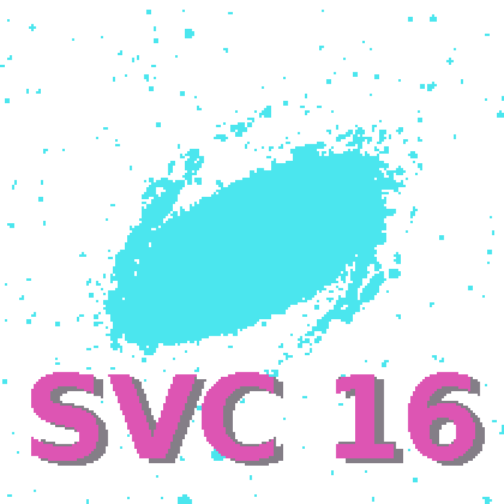

<p align="center">
  
</p>

# SVC16: A Simple Virtual Computer

The landing page, WebAssembly emulator, and documentation have moved to:

👉 **[https://janneuendorf.github.io/SVC16/](https://janneuendorf.github.io/SVC16/)**

This repository contains the source code for building the website and some example games.

## Self-Hosting

Run the pre-built site with the emulator locally:

```bash
git clone https://github.com/JanNeuendorf/SVC16 && python -m http.server -d SVC16/docs
```

To make development and fast iteration easier, you can also compile a native desktop build of the emulator with Odin using the `just build_desktop` command (or compile directly with `odin build source/main_desktop [options...]`).


## Contributing

First of all, if you managed to build a cool game or program for the system, please share it!

If you find a discrepancy between the specifications and the behavior of the emulator or some other problem or bug, feel free to open an issue. Please report things that are not explained well.

Note that breaking changes to the specifications including simple additions will not be considered, as the virtual computer itself is meant to be completely stable.

