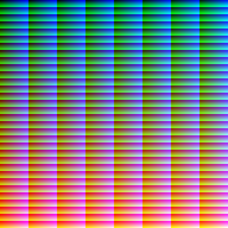

## The first program

A simple example would be to print all $2^{16}$ possible colors to the screen.
We make our lives easier, by mapping each index of the screen-buffer to the color which is encoded with the index.
Here, we use the names of the opcodes instead of their numbers.

```
Set 501 1 0       // Write the value 1 to address 501
Set 502 65535 0   // Write the largest possible value to 502
Print 500 500 0   // Display color=@500 at screen-index=@500
Add 500 501 500   // Increment the color/screen-index
Cmp 500 502 503   // See if we are not at the max number
Xor 503 501 503   // Negate it
Skip 0 4 503      // Unless we are at the max number, go back 4 instructions
Sync 0 0 0        // Sync 
GoTo 0 0 0        // Repeat to keep the window open
```
We could rely on the fact that the value at index 500 starts at zero and we did not have to initialize it.

To build a program that we can execute, we could use python:

```python
import struct

code = [
    0, 501, 1, 0, #Opcodes replaced with numbers
    0, 502, 65535, 0,
    11, 500, 500, 0,
    # ...
]
with open("all_colors.svc16", "wb") as f:
    for value in code:
        f.write(struct.pack("<H", value))

```

Inspecting the file, we should see:
```ansi
➜ hexyl examples/all_colors.svc16 -pv --panels 1

  00 00 f5 01 01 00 00 00
  00 00 f6 01 ff ff 00 00
  0b 00 f4 01 f4 01 00 00
  03 00 f4 01 f5 01 f4 01
  07 00 f4 01 f6 01 f7 01
  0e 00 f7 01 f5 01 f7 01
  02 00 00 00 04 00 f7 01
  0f 00 00 00 00 00 00 00
  01 00 00 00 00 00 00 00
``` 

When we run this, we get the following output:



